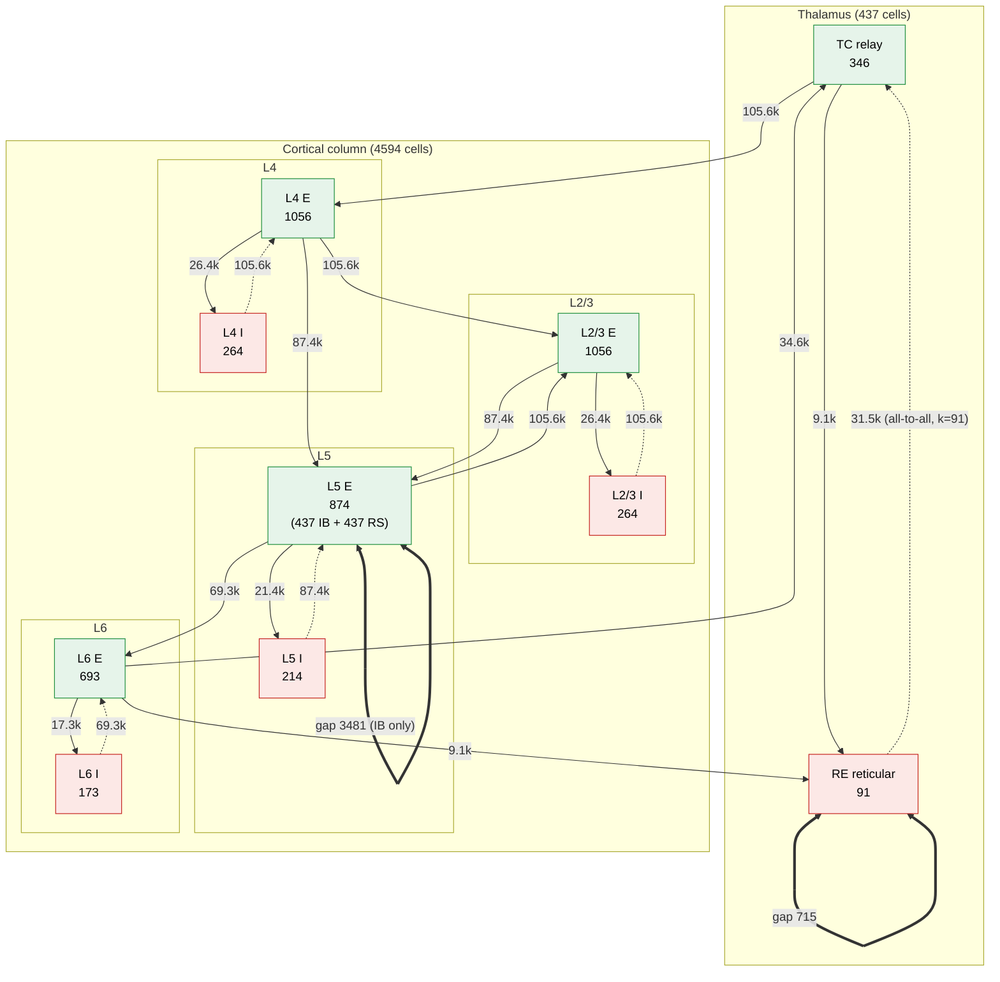
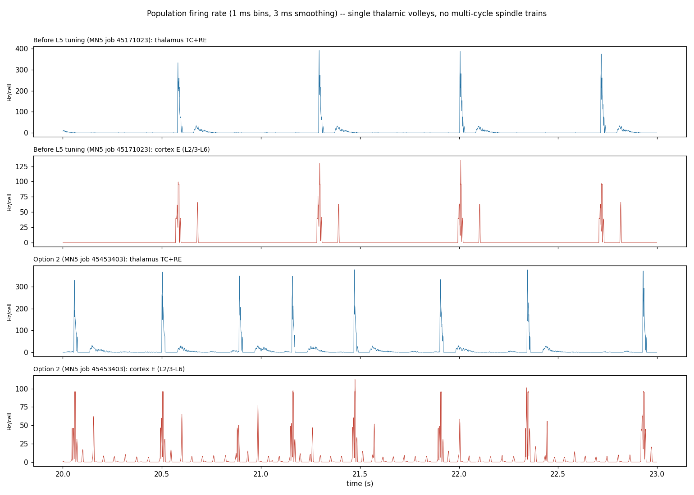
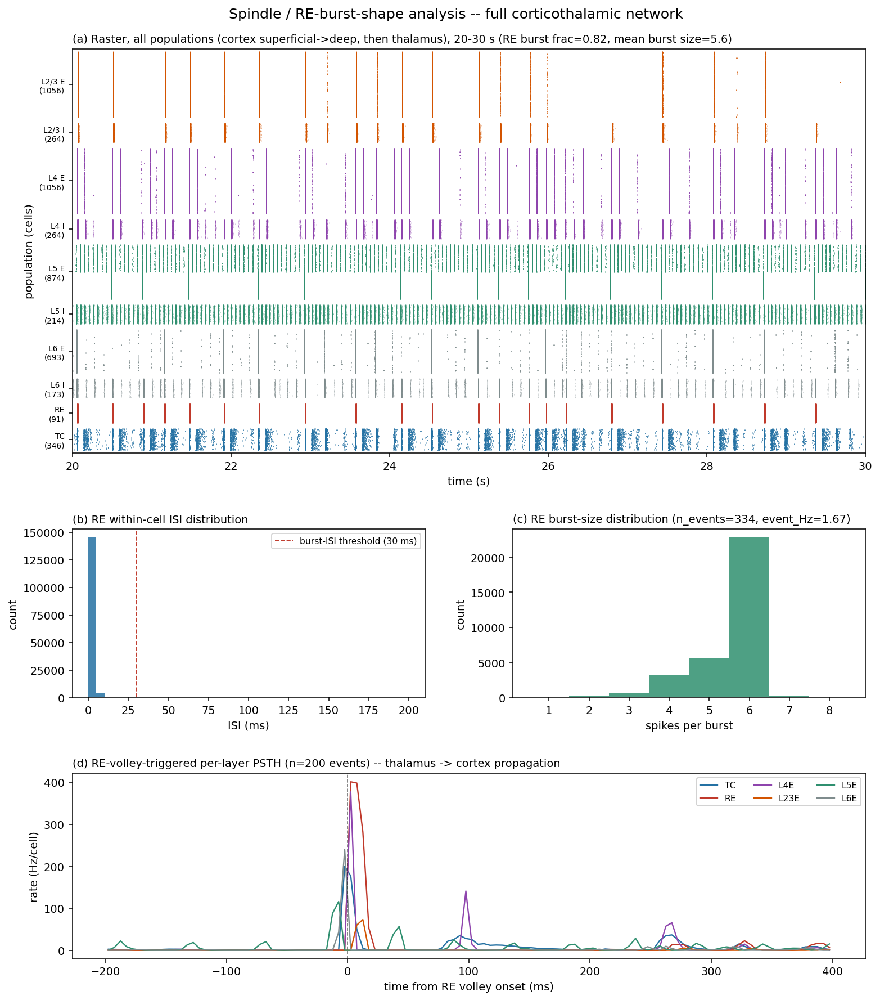
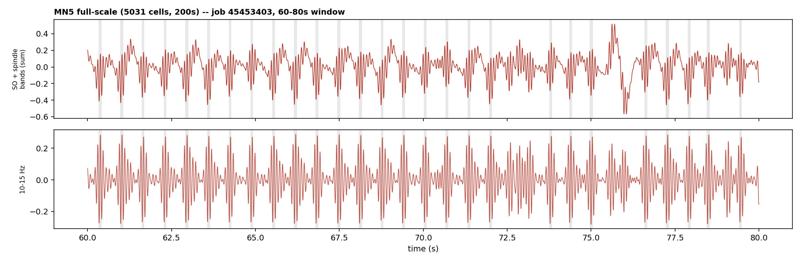
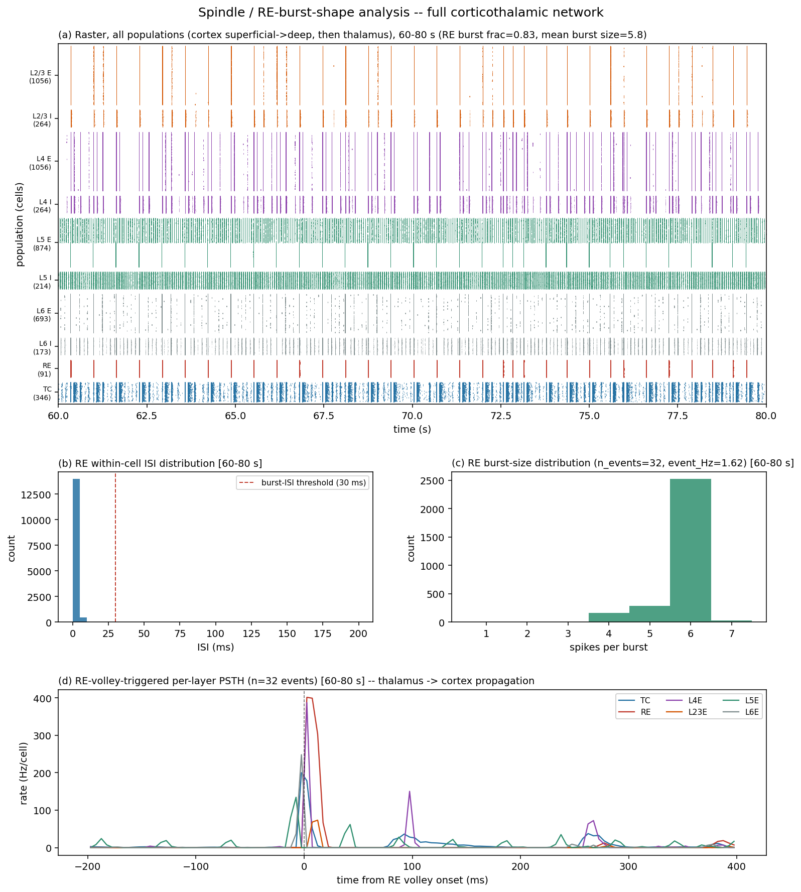
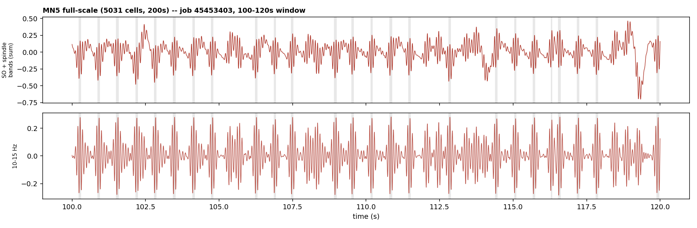
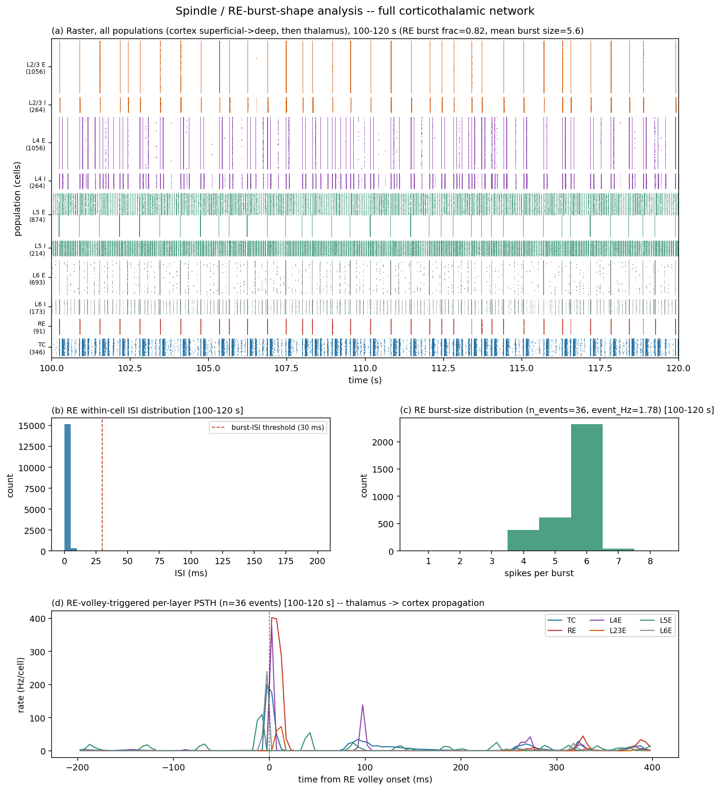
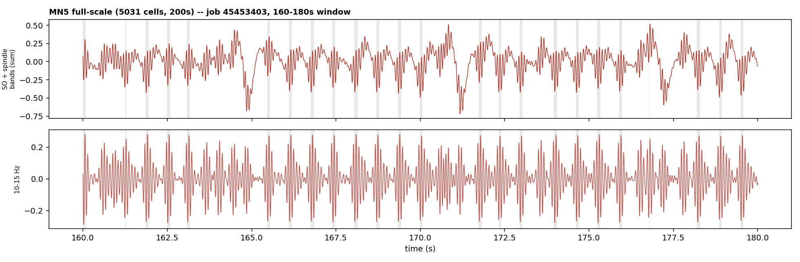
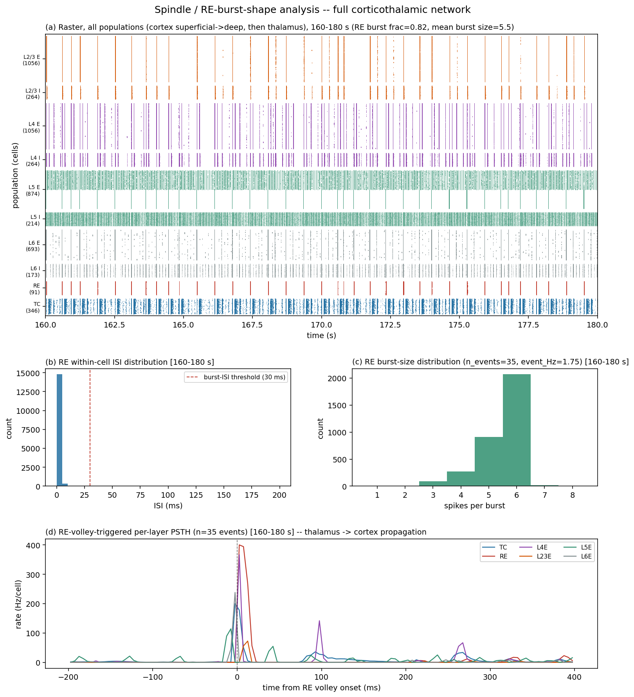

# Educational questions about the project

## 1) How do we know when a spindle starts? (grey rectangles in the figure)

Figure: `out/compare_regularity_vs_literature_score.png` (commit `7b3e1c8`).

The grey rectangles come from a simple threshold on the spindle-band amplitude.
The figure is drawn by `make_comparison_figure` in `neuron/ctx_analyze.py`
(committed in `7170e23`), which detects events with `_detect_spindles`. The
same definition is used for scoring in `_literature_score` in
`neuron/ctx_thalamus_mpi.py`; the two are kept in sync by hand.

### How a spindle start is found

1. **Build an LFP-like signal.** For each excitatory layer (L2/3, L4, L5, L6),
   spike times are binned at 1 ms. Each binned signal is convolved with a
   synaptic-shaped kernel (2 ms rise, 100 ms decay) and z-scored. L5 and L6 are
   sign-flipped, and the four layers are averaged into one signal.
2. **Band-pass the signal to 10–15 Hz.** This is the lower trace of each pair
   in the figure.
3. **Take the Hilbert envelope**, `env = |hilbert(spin)|`, which is the
   instantaneous amplitude of that oscillation.
4. **Set the threshold** at `mean(env) + 1.5·SD(env)`, computed over the whole
   run except the first second. That second holds the network's start-up
   transient and filter edge effects, and it is excluded from detection too.
   The exclusion was added after the comparison figure was made, so the
   committed PNG and earlier grid-sweep numbers used the whole run.
5. **Mark events:** a spindle starts where the envelope rises above the
   threshold and ends where it falls back below. Each grey rectangle is one
   span where the envelope stays above the threshold.

### What this means for the figure

- **The "start" is when the envelope crosses the threshold, not when the
  spindle visibly begins.** In Option 1 the oscillation can be seen building up
  before the grey box. The box only covers the high-amplitude peak, roughly
  100–150 ms.
- **There is no minimum duration and no merging of nearby events.** That's why
  a very thin sliver appears near 9.6 s in Option 2. Two short crossings close
  together count as two events.
- **The threshold adapts to each run.** Option 2 has 10–15 Hz activity almost
  everywhere, which raises the envelope's mean and SD. As a result, only the
  few biggest bursts cross the threshold. So the low event count in Option 2
  partly reflects this choice of threshold, not only how the network behaves.
- **This is simpler than standard spindle detection in the literature.**
  Detectors there usually require a duration of about 0.5–2 s and use two
  thresholds: a high one to detect the event and a lower one to set its
  boundaries. The events here are much shorter than that. So the shaded boxes
  are really "spindle-band amplitude peaks", not spindles in the strict EEG
  sense. That matters if `n_spindle_events` or `spindle_cv` are compared
  directly to published numbers.
- **Most shaded events are filter ripple from one thalamic volley, not a
  spindle.** On the MN5 runs, a 10–15 Hz band-pass of a single sharp volley
  already produces about 200 ms (about 3 cycles) of 12 Hz ripple, and the model's
  spindle-band envelope matches that of a pure impulse. See question 5.

### Possible follow-ups

- Add two-threshold detection with a minimum duration, so start and end times
  match the literature definition.

## 2) What is the network architecture? (number of neurons and synapses/projections)

Source of truth: `ParallelCorticoThalamicNet` in `neuron/ctx_thalamus_mpi.py`
(the MPI/MN5 model). All counts below are computed from its wiring code
(`DEFAULT_SIZES`, `_project`, `_wire_re_re_local`, `_wire_l5_recurrent`,
`_wire_gap_range`) with the production defaults `--conv 100`, `ib_frac=0.5`,
`gap_deg=6`, `gap_short=2`.

Two sizes are in use:

- `--scale 1.0` gives **3050 cells**, the sizes declared in
  `config/network_auditory_mn5_5k.yaml`.
- `--scale 1.65` gives **5031 cells**. This is the MN5 full-scale run (job
  45453403) and the size shown in the diagram.

### Diagram (scale 1.65, 5031 cells)

Solid arrows are excitatory (AMPA-like, E = 0 mV). Dotted arrows are inhibitory
(GABA_A). Double-headed thick links are gap junctions. Edge labels give the
number of connections (NetCons) in the projection.



### Neurons

| Population | Cell model | scale 1.0 | scale 1.65 |
|---|---|---:|---:|
| TC (thalamocortical relay) | `tc_neuron.TCCell` | 210 | 346 |
| RE (thalamic reticular) | `tc_neuron.RECell` | 55 | 91 |
| L4 E / I | `PYCell` / `FSCell` | 640 / 160 | 1056 / 264 |
| L2/3 E / I | `PYCell` / `FSCell` | 640 / 160 | 1056 / 264 |
| L5 E / I | half `PYCellIB` (intrinsically bursting), half `PYCell` (RS) / `FSCell` | 530 / 130 | 874 / 214 |
| L6 E / I | `PYCell` / `FSCell` | 420 / 105 | 693 / 173 |
| **Total** | | **3050** | **5031** |

### Projections (chemical synapses)

Wiring uses **fixed convergence**. Each target cell draws `k = min(conv, N_pre)`
random presynaptic cells, so a projection has `N_post × k` connections. Each
target has one `Exp2Syn` per projection, and every connection is a NetCon onto
it with weight `g / k`. So `g` is the total conductance a target cell gets from
that projection, in µS. The shared delay is 1 ms.

| Projection | Type (E_rev, τ1/τ2 ms) | g (µS) | k | # conn. scale 1.0 | # conn. scale 1.65 |
|---|---|---:|---:|---:|---:|
| TC → RE | AMPA (0, 0.5/2) | 0.011 | 100 | 5 500 | 9 100 |
| RE → TC | GABA_A (−85, 1/8) | 0.015 | all RE (55 / 91) | 11 550 | 31 486 |
| RE → RE | GABA_A (−75, 1/6), ±2 neighbours | 0.006 ± 0.002 per conn. | ≤4 | 214 | 358 |
| TC → L4E | AMPA (0, 0.5/2) | 0.02 | 100 | 64 000 | 105 600 |
| L4E → L2/3E | AMPA | 0.0015 | 100 | 64 000 | 105 600 |
| L4E → L5E | AMPA | 0.00075 | 100 | 53 000 | 87 400 |
| L2/3E → L5E | AMPA | 0.0015 | 100 | 53 000 | 87 400 |
| L5E → L2/3E | AMPA | 0.0015 | 100 | 64 000 | 105 600 |
| L5E → L6E | AMPA | 0.009 | 100 | 42 000 | 69 300 |
| L6E → TC | AMPA | 0.03 | 100 | 21 000 | 34 600 |
| L6E → RE | AMPA | 0.03 | 100 | 5 500 | 9 100 |
| E → I, each layer (L4, L2/3, L5, L6) | AMPA | 0.02 | 100 | 16 000 / 16 000 / 13 000 / 10 500 | 26 400 / 26 400 / 21 400 / 17 300 |
| I → E, L4, L2/3, L6 | GABA_A (−75, 1/8) | 0.08 | 100 | 64 000 / 64 000 / 42 000 | 105 600 / 105 600 / 69 300 |
| I → E, L5 | GABA_A (−75, 1/8) | `g_i_e_l5`: 0 by default, 0.02 in Options 1/2 | 100 | 53 000 | 87 400 |
| L5E → L5E recurrence (opt-in) | NMDA (Options 1/2) or Exp2Syn | `g_l5_rec`: 0 by default, 0.013 in Options 1/2 | 100 | 53 000 | 87 400 |
| **Total without L5 recurrence** | | | | **662 264** | **1 104 944** |
| **Total with L5 recurrence** | | | | **715 264** | **1 192 344** |

The L5 I → E connections are always created, even when `g_i_e_l5 = 0`. They
just carry zero weight.

Options 1 and 2 are the two L5-recurrence tunings compared in question 1.
Both use `g_l5_rec = 0.013` with the NMDA mechanism. Option 1 uses
`tau2 = 115, taur = 100`; Option 2 uses `tau2 = 200, taur = 120`.

### Gap junctions (electrical)

Small-world topology: a ring with ±3 neighbours plus 2 random shortcuts per
cell. The counts below are one-directional `GapMPI` halves.

| Group | g (µS) | scale 1.0 | scale 1.65 |
|---|---:|---:|---:|
| RE ↔ RE | 0.03 | 423 | 715 |
| L5 IB ↔ L5 IB (the first half of L5E) | 0.02 | 2 103 | 3 481 |

### What the architecture does *not* contain

- Within-layer E → E synapses, except the opt-in L5 recurrence.
- Direct L2/3 → thalamus or L6 → L4 connections. The only cortical output to
  the thalamus is L6E.
- Any input to L4E other than TC. That makes TC → L4E the only ascending arm
  of the loop.
- Any interneuron subtypes. All I cells are a single fast-spiking type
  (`FSCell`). The NEST reference model splits cells into Basket/LTS/Axoaxonic
  and RS/FRB/Tuft subtypes, and this model does not reproduce those splits.

## 3) How is the LFP calculated from the neuronal activity?

The simulation doesn't compute a real LFP, because it never records any
voltages or currents. The only output saved is spike times:
`pc.spike_record` in `neuron/ctx_thalamus_mpi.py` (line ~188), written to the
`.npz` with gids and population ranges. The "LFP" is a **proxy built
afterwards from those spikes**. The code is `_synaptic_lfp` in
`neuron/ctx_analyze.py` (line ~242), with an identical copy
(`_synaptic_lfp_local`) in `neuron/ctx_thalamus_mpi.py` (line ~603).

### Steps

1. **One trace per layer.** The excitatory cells of each layer (L2/3E, L4E,
   L5E, L6E) are taken separately. Inhibitory cells are left out.
2. **Count spikes per 1 ms bin.** This gives the whole population's spike count
   over time, not per-cell rates.
3. **Smooth with a synaptic-shaped kernel.** Each spike is replaced by a
   PSP-like waveform, `exp(-t/100) − exp(-t/2)`: 2 ms rise, 100 ms decay, cut
   off at 800 ms and scaled to a peak of 1. The smoothing only uses past
   spikes. The idea is that a real LFP comes mostly from slow synaptic
   currents, not from the spikes themselves.
4. **Normalise each layer** to mean 0 and SD 1.
5. **Flip the sign of L5 and L6.** This mimics the usual dipole in laminar
   recordings, negative near the surface and positive in deep layers. In the
   LFP figure the RE trace is flipped too.
6. **Average the four layers** into one cortical signal. The thalamic trace is
   the average of TC and RE.
7. **Band-pass filter** (3rd-order Butterworth, applied forwards and backwards
   so there's no phase shift):
   - slow oscillation: 0.5–2 Hz
   - spindle band: 8–15 Hz in `make_lfp_figure`, but 10–15 Hz in
     `_literature_score` and in the comparison figure from question 1
   - Hilbert envelope of the spindle band

The "raw (SO+spindle)" panel in the comparison figure is **not** the unfiltered
signal: it is the 0.5–2 Hz band plus the 10–15 Hz band added together
(`make_literature_reconstruction_figure` / `make_comparison_figure` in
`neuron/ctx_analyze.py`). Because everything outside those two bands is
removed, any run will look like slow oscillations with spindles on top, so its
visual similarity to published raw traces is weak evidence on its own. The
code now labels this panel "SO + spindle bands (sum)"; the committed PNGs
made before that change still show the old "raw" label.

The mean-field figure uses a simpler proxy still: the population firing rate,
smoothed with a 5 ms moving average (`make_meanfield_figure` in
`neuron/ctx_analyze.py`).

### Example: LFP proxy from two full-scale MN5 runs


Both runs are 5031 cells and 200 s on MN5; the plot shows 20–30 s, after the
start-up period, on identical y-scales. For each run the upper trace is the
0.5–2 Hz band plus the 10–15 Hz band, the lower trace is the 10–15 Hz band
alone, and grey boxes are detected spindle events (question 1). The third
panel is a spike raster of every population (cortex L2/3 → L6, then RE, TC)
with the same shading, so each shaded event can be matched to the spikes
under it: in both runs each one sits on a single thalamic volley (question 5).

- **Top, job 45171023:** before the L5 tuning. It predates three changes: L5
  recurrence, weaker L5 inhibition (`g_i_e_l5`) and slower L5 adaptation
  (`taur_l5e_rs`).
- **Bottom, job 45453403:** Option 2, with all three changes (L5 NMDA
  recurrence, `tau2 = 200 ms`, `taur = 120 ms`, `g_i_e_l5 = 0.02`).

Option 1 has not been run on MN5, so this is not the Option 1 vs Option 2
comparison from question 1, and the difference reflects the three L5 changes
together, not the recurrence alone.

Over the full run (first second excluded):

| | Spindle events | Rate | Interval between events | CV of intervals | Median event length | SO amplitude (RMS) |
|---|---:|---:|---:|---:|---:|---:|
| Before L5 tuning | 279 | 1.40/s | 712 ± 2 ms | 0.00 | 106 ms | 0.090 |
| Option 2 | 258 | 1.30/s | 771 ± 384 ms | 0.50 | 85 ms | 0.119 |

Before the tuning the network is a metronome: one spindle every 712 ms with
±2 ms jitter and a steady sawtooth slow wave. Option 2 has irregular spindle
timing, with bunched events and long gaps, and a larger slow wave with deep
troughs (around 21 s and 26 s). The "grey box = amplitude peak, not a full
spindle" caveat from question 1 applies to both.

Regenerate with:

```bash
python3 neuron/ctx_analyze.py --compare "MN5 job 45171023: before L5 tuning (no L5 recurrence)=res/2026-08-31/ctx_nrn_45171023.npz,MN5 job 45453403: Option 2 (L5 NMDA recurrence; tau2 200 ms / taur 120 ms)=res/2026-09-07/ctx_nrn_45453403.npz" --outdir out --tag mn5_before_vs_option2 --window-start 20000 --window-len 10000
```

Labels can't contain `,` or `=`, because `--compare` splits on them.

### How this differs from a real LFP

- **A layer's trace is built from that layer's own output spikes.** A real LFP
  comes from the synaptic currents flowing into the cells at the recording
  site. The proxy is really "the current these spikes would cause downstream",
  credited to the layer that fired them.
- **One 100 ms kernel is used for every spike,** but the model's AMPA synapses
  decay in 2 ms and GABA_A in 6–8 ms. Only the optional L5 NMDA synapses are
  that slow (115–200 ms). So the proxy is much smoother than the real synaptic
  currents and can add slow-wave content that doesn't exist in them. The
  docstring explains the history: the kernel used to be 10 ms / 60 ms, which
  hid the slow content. Moving to 100 ms fixed that, but may now overstate it.
- **Normalising each layer gives all four equal weight,** whatever their cell
  counts and firing rates.
- **The model has no electrode position and no dendritic geometry.** The
  deep-layer sign flip is a convention, not a calculated dipole.
- **Inhibition contributes nothing,** although real LFPs carry a large
  GABAergic component, especially during spindles.

### More standard options, if needed

- **Record synaptic currents in NEURON** (the `Exp2Syn`/`NMDA` currents per
  population) and use a current-based proxy. Mazzoni et al. (2015, *PLoS
  Comput Biol*) showed that a weighted sum of AMPA and GABA currents tracks the
  real LFP well.
- **Calculate the extracellular potential directly** with NEURON's
  `extracellular` mechanism or LFPy. Both need cell morphology, which the
  current point-like cells mostly lack.

## 4) Can we calculate the EEG from the LFP? If yes, how?

Not from the LFP trace we have now. But yes from the same simulation, by
computing a different quantity.

### Why the current LFP trace can't be converted

An LFP and an EEG are two measurements of the same thing: currents crossing
neuron membranes. They measure it in different ways.

- **An LFP** is the voltage at one point inside the tissue, dominated by nearby
  cells.
- **An EEG** is the voltage on the scalp. At that distance, the tissue's
  currents only matter through their net **current dipole moment**: roughly,
  how much current flows along the pyramidal cells' long axis. The scalp signal
  is that dipole seen through the brain, cerebrospinal fluid, skull and skin.

The standard chain is therefore:

> membrane currents → current dipole moment **p(t)** → head model (volume
> conductor) → scalp voltage

This uses the dipole, not the LFP. Our current LFP proxy (question 3) doesn't
contain the dipole: it's built from spike times with one standard kernel and a
sign convention we chose, not from real currents.

One useful consequence: the head model is quasi-static, meaning it has no
delays or frequency filtering. For one cortical patch with a fixed
orientation, the scalp signal is just the dipole's time course multiplied by a
constant. So **the EEG waveform is the dipole waveform**. The head model only
sets the amplitude in µV and how the signal spreads across electrodes.

### How to do it in this project (best option first)

**A. Compute the dipole directly in NEURON (most accurate, and practical
here).** Our pyramidal cells (`PYCell` in `neuron/cortex_neuron.py`) have a
25 µm soma plus a 300 µm dendrite split into 5 segments, and synapses sit at
the middle of the dendrite. That is enough geometry to compute a dipole:

1. Turn on NEURON's fast membrane-current output (`cvode.use_fast_imem(1)`).
2. For each cell, compute `p_z(t) = Σ_seg i_membrane(seg) · z(seg)`, with z
   measured along the soma–dendrite axis. Assume all pyramidal dendrites are
   parallel and point towards the brain surface.
3. Sum over the cells on each MPI rank, add up the ranks, and save at 1 kHz
   next to the spikes.
4. Which cells to include:
   - Include L2/3E, L5E and L6E.
   - Leave out L4E, which in reality is mostly stellate cells whose currents
     cancel out.
   - FS interneurons have no dendrite, so they contribute nothing anyway.
   - Leave out the thalamus: it is deep and its geometry cancels out, so it
     isn't visible in EEG.

This needs code changes in `neuron/ctx_thalamus_mpi.py` and new MN5 runs.

**B. Current-based EEG proxy.** Martínez-Cañada et al. (2021, *PLoS Comput
Biol*) built an EEG proxy for simple point-neuron networks. It is a weighted
sum of the AMPA and GABA currents onto pyramidal cells, and was validated
against full biophysical models. It needs synaptic currents to be recorded, so
it also needs new runs. It's simpler than A but less faithful to our actual
geometry.

**C. From spikes only, using the existing `.npz` files.** The kernel method of
Hagen et al. (2022, *PLoS Comput Biol*) convolves each population's firing rate
with a kernel for each projection, to predict the dipole. Our current proxy is
a crude version of this, with one kernel for everything. Using per-projection
kernels with the right synapse time constants and signs would already help.
This is the least accurate option, but it needs no new simulations.

**Then the head model**, only needed for µV values or electrode maps: LFPy has
a four-sphere head model (Næss et al. 2017) and the realistic New York Head
model (Huang et al. 2016). Hagen et al. (2018) describe using them in LFPy 2.0.

### Caveats

- **Amplitude.** 5031 cells is a tiny patch. A scalp EEG needs several cm² of
  cortex active together, which is millions of neurons. Absolute µV values
  therefore depend on assuming how many columns act together. The total scales
  roughly with the number of columns if they are perfectly in sync, or with its
  square root if they are independent. The waveform, spectrum and
  spindle/slow-oscillation timing are what can be compared with real data, not
  the amplitude.
- **Geometry is simplified.** Every synapse sits at the same point on a single
  straight dendrite. So the dipole's sign mostly reflects excitation versus
  inhibition at that spot. Real L5 cells, for example, also get input on their
  apical tuft.
- **The benefit.** With an EEG-like signal, we could apply standard sleep-EEG
  spindle detectors and compare with published values: spindle density per
  minute at central electrodes, and how spindles line up with slow
  oscillations. That's a better target than the LFP-proxy comparisons so far.

### References

- Hagen E, Næss S, Ness TV, Einevoll GT (2018). Multimodal modeling of neural
  network activity: computing LFP, ECoG, EEG, and MEG signals with LFPy 2.0.
  *Front Neuroinform*.
- Hagen E et al. (2022). Brain signal predictions from multi-scale networks
  using a linearized framework. *PLoS Comput Biol*.
- Huang Y, Parra LC, Haufe S (2016). The New York Head — a precise
  standardized volume conductor model for EEG source localization and tES
  targeting. *NeuroImage*.
- Martínez-Cañada P, Ness TV, Einevoll GT, Fellin T, Panzeri S (2021).
  Computation of the electroencephalogram (EEG) from network models of point
  neurons. *PLoS Comput Biol*.
- Næss S et al. (2017). Corrected four-sphere head model for EEG signals.
  *Front Hum Neurosci*.

## 5) Does the simulation produce continuous oscillations or distinct events?

**Distinct events, but they are not spindles.** Both full-scale MN5 runs
(5031 cells, 200 s) produce a train of single, separate thalamic volleys. In
each volley nearly every TC and RE cell bursts at once. The main peak is only
a few ms wide, and the whole volley is over within a few tens of ms. The
volleys are separated by 600–700 ms of near-silence. Nothing in the thalamus
oscillates at spindle frequency (10–15 Hz): no volley is ever followed by
another within 200 ms. At most there is a weak second bump about 90 ms later.



Full 200 s of each run (first second excluded):

| | Before L5 tuning (45171023) | Option 2 (45453403) |
|---|---:|---:|
| Thalamic volleys | 279 (1.40/s) | 378 (1.90/s) |
| Interval between volleys | 712 ms, CV 0.00 | 591 ms (5–95%: 258–649), CV 0.28 |
| Volleys following another within 200 ms (spindle-like trains) | 0% | 0% |
| Strongest activity 50–250 ms after a volley | 9% of the volley peak | 9% of the volley peak |
| Time the thalamus is active (> 20 Hz per cell) | 5% | 7% |
| Cortex between volleys | silent | low-level ~19 Hz activity |

### Why the figures look like spindles

It comes from the filter, not from the network. A 10–15 Hz band-pass filter
turns any single sharp spike into about 200 ms of 12 Hz ripple, roughly 3
cycles. The test: average the width of the spindle-band amplitude around the
volleys, and compare it with a train of pure impulses placed at the same
times, run through the same filter.

- Before L5 tuning: 225 ms for the model vs 210 ms for pure impulses.
- Option 2: 690 ms vs 705 ms. These are wider because volleys are closer
  together, so each average also picks up the neighbouring volleys' ripple.

The network's signal matches the pure impulses almost exactly. So **the
grey-boxed "spindles" in the comparison figures (questions 1 and 3) are mostly
the filter's response to one volley.** This also affects `n_spindle_events`
and `spindle_cv` in `_literature_score`: they count single volleys, not
spindles.

### What the two runs actually show

- **Before L5 tuning:** a perfectly regular 1.4 Hz train. Each cycle has one
  thalamic volley, a cortical response and then a DOWN state where the cortex
  is completely silent.
- **Option 2:** the same kind of volleys, but faster (1.9/s) and irregular.
  The cortex is no longer silent between them. L5 keeps up ongoing activity at
  about 19 Hz, driven mostly by its interneurons, which fire about 22 Hz per
  cell between volleys, plus L5E (1.7 Hz per cell) and L4E (1.0 Hz per cell).
  This is the NMDA recurrence at work. So Option 2 does contain a continuous
  oscillation, but at low amplitude and at about 19 Hz (beta range), not at
  spindle frequency.

Compared with real sleep, where spindles last 0.5–2 s and contain about 7–15
waxing and waning cycles at 11–16 Hz, the model has the
slow-oscillation-like part (periodic UP events, though at 1.4–1.9 Hz, faster
than the usual < 1 Hz). It has **no spindles**.

### Why the thalamic loop fires only once (hypotheses, not tested)

A spindle needs a repeating cycle: RE inhibits TC → TC fires a rebound burst →
TC excites RE → repeat. Here the second cycle reaches only 9% of the first.
Two possible reasons:

1. The whole thalamus fires in near-perfect synchrony, at about 370 Hz per
   cell at the peak. Every TC cell then recovers on the same schedule, so
   there's no partly recruited population left to carry the next cycle.
2. The RE → TC inhibition is only fast GABA_A (8 ms decay) with no GABA_B.
   That may be too short to de-inactivate TC's T-type calcium current (I_T)
   again for a second rebound.

A "cycles per volley" measure on the spike data would test fixes for either
one directly, without going through the band-pass filter.

### Reproduce

The figure and every number above come from `neuron/volley_stats.py`:

```bash
python3 neuron/volley_stats.py "Before L5 tuning (MN5 job 45171023)=res/2026-08-31/ctx_nrn_45171023.npz" "Option 2 (MN5 job 45453403)=res/2026-09-07/ctx_nrn_45453403.npz" --plot out/mn5_population_rates_before_vs_option2.png
```

## 6) What do the cortical cells do? (full raster of every population)

The spindle figure's panel (a) used to show only TC and RE. It now shows every
population, in anatomical order: cortex from L2/3 down to L6 (E, then the
lighter-shaded I cells of each layer), then RE and TC. Rows are proportional
to cell count, with a minimum height for small populations so they stay
readable. MN5 job 45453403 (Option 2, 5031 cells), 20–30 s:



What the raster shows:

- **Each thalamic volley reaches the whole column.** Every RE volley lines up
  with one sharp column of spikes in L2/3, L4 and L6. Between volleys, L2/3 is
  almost silent.
- **L5 is two populations.** The lower half of the L5 E row is the 437
  intrinsically bursting (IB) cells: they fire only with the volleys
  (3.2 Hz per cell). The upper half is the 437 regular-spiking cells recruited
  by the NMDA recurrence: they fire continuously (8.7 Hz per cell), locked to
  L5 I at about 19 Hz. This is the ongoing ~19 Hz activity from question 5,
  and it comes from the regular-spiking half of L5, not the bursting cells.
- **L4 fires more often than the volleys,** following the scattered TC firing
  that continues for about 100–200 ms after each volley.
- **L6 E fires sparsely.** Its synchronised spikes line up with the volleys:
  this is the output that drives the thalamus.

Panels (b)–(d) are unchanged: RE's within-cell ISI distribution, RE burst
sizes, and the RE-volley-triggered firing rate of each layer.

Regenerate with:

```bash
python3 neuron/ctx_analyze.py res/2026-09-07/ctx_nrn_45453403.npz --outdir out --tag ctx_45453403
```

The same raster is added under each run in the LFP comparison figure
(`make_comparison_figure`, question 3); `--no-raster` turns it off there.

## 7) Why is RE so synchronised?

In the Option 2 MN5 run (45453403) every one of the 357 RE volleys recruits
all 91 RE cells, and their first spikes differ by a median of just **16 µs**
(max 0.3 ms). The main cause is the **RE ↔ RE gap junctions: they are about
30× too strong**, which turns the 91 RE cells into what is effectively one big
cell. The synchronised L6 input adds to it but is secondary.

### 1. The gap junctions (the main cause)

Measured in NEURON:

| | Value |
|---|---|
| One RE cell's own membrane conductance at rest | 0.007 µS |
| One gap junction (`g_gap = 0.03 µS`) | 4.3× the cell's own conductance |
| Gap junctions per RE cell (ring ±3 plus 2 random shortcuts) | 7.9, a total of 34× the cell's own conductance |
| Coupling to the nearest neighbour | 0.43 |
| Coupling to the cell on the far side of the ring | 0.27 |

The coupling coefficient is the fraction of one cell's voltage change that
appears in another. Reported values for real reticular-nucleus cells are
mostly a few percent, rarely above about 0.1, and only between nearby cells.
Here even cells at opposite ends of the nucleus share 27%.

**The experiment that separates the causes.** 91 RE cells with the same
gap-junction layout, no TC, no RE → RE inhibition, no cortex. Each cell gets
100 inputs from a 693-cell "L6" volley whose timing is deliberately spread
out:

| Spread of the L6 input (SD) | RE spread, gap junctions on | RE spread, gap junctions off |
|---|---:|---:|
| 0.5 ms | 0.02 ms | 0.41 ms |
| 3 ms | 0.05 ms | 0.71 ms |
| 10 ms | 0.07 ms | 2.4 ms |
| 25 ms | 0.08 ms | 9.9 ms |

With the gap junctions on, RE fires within 0.1 ms however spread out the input
is. With them off, RE's timing follows the input. The MN5 run's 16 µs sits in
the gap-junctions-on regime.

### 2. Secondary causes

- **Synchronised input:** in every volley, all L6E cells fire about 6 ms
  before RE (median lead 5.7 ms), and each RE cell samples 100 of them. So
  even without gap junctions, RE would get a nearly identical kick.
- **No noise:** the model has no background input or noise sources, so
  nothing breaks up identical timing.
- **All-or-none bursts:** once the T-type calcium current (I_T) fires, the
  burst time is set mainly by the channel's kinetics, not by small input
  differences.

### Why this wasn't caught earlier

`neuron/README.md` tested gap strength (0.03 → 0) in the 10–40-cell model and
saw "no effect". In a network that small every cell is a near neighbour
anyway, so the problem only shows at 91 cells. The value 0.03 appears to have
carried over from there.

### What gap strength would be realistic

| `g_gap` (µS) | Nearest neighbour | Far side of the ring |
|---|---:|---:|
| 0.03 (current) | 0.43 | 0.27 |
| 0.01 | 0.28 | 0.11 |
| 0.003 | 0.17 | 0.03 |
| **0.001** | **0.09** | **0.008** |
| 0.0005 | 0.06 | 0.003 |

About **0.001 µS**, 30× weaker than now, gives realistic local coupling.

This matters for spindles (question 5). With RE locked this tightly, every TC
cell receives exactly the same inhibition at the same moment, so the whole
thalamus fires once and is exhausted together. Weakening the gap junctions is
step 2 of Stage 1 in `PLAN-spindels.md`, now with this target.

Caveat: the test used RE alone. But the effect is large (0.08 ms vs 9.9 ms),
so the conclusion should hold in the full network.

### Reproduce

The NEURON measurements come from `neuron/re_gap_sync_test.py`:

```bash
cd neuron && ../.venv-neuron/bin/python re_gap_sync_test.py
```

## 8) Is the activity the same over the whole 200 s run? (different time windows)

The Option 2 MN5 run (job 45453403, 5031 cells) lasts 200 s, but most figures
show only 20–30 s or 20–40 s. Here are the same LFP reconstruction and spindle
analysis for three later 20 s windows: **60–80 s, 100–120 s and 160–180 s**.

In the spindle figures, panels (b)–(d) (RE ISIs, burst sizes, and the RE
volleys the PSTH is aligned on) are computed **from each window only**
(`--stats-in-window`). Previously they always covered the whole run, so they
would have been identical in all three figures. Each panel title says which
period it covers.

### How the windows compare

20–40 s included as a reference:

| Window | Thalamic volleys | Mean interval (CV) | Detected "spindles" | SO-band RMS | RE burst size | L5 RS / IB (Hz per cell) |
|---|---:|---:|---:|---:|---:|---:|
| 20–40 s | 44 (2.20/s) | 458 ms (0.33) | 21 | 0.135 | 5.2 | 8.8 / 3.2 |
| 60–80 s | 37 (1.85/s) | 530 ms (0.28) | 27 | 0.106 | 5.8 | 8.6 / 3.1 |
| 100–120 s | 38 (1.90/s) | 531 ms (0.25) | 25 | 0.105 | 5.6 | 8.7 / 3.2 |
| 160–180 s | 39 (1.95/s) | 513 ms (0.27) | 23 | 0.140 | 5.5 | 8.7 / 3.1 |

- **The network settles and stays settled.** After the first ~40 s the volley
  rate stays at 1.85–1.95/s. RE burst size, the L5 firing rates and the
  volley-triggered response in panel (d) are nearly identical in every window.
  There's no drift across the 200 s.
- **The main difference is the large slow dips.** 60–80 s and 100–120 s are
  quieter and more regular, with about one deep trough each (around 76 s and
  119 s). 160–180 s has three (around 165, 171 and 177 s), like the 20–40 s
  window. That's why its slow-oscillation amplitude is higher.
- **Question 5's conclusion holds across the whole run.** In every window,
  each shaded "spindle" sits on a single RE volley. There are no multi-cycle
  trains anywhere.

### 60–80 s





### 100–120 s





### 160–180 s





### Reproduce

The table:

```bash
python3 neuron/volley_stats.py "Option 2 (MN5 job 45453403)=res/2026-09-07/ctx_nrn_45453403.npz" --windows "20-40,60-80,100-120,160-180"
```

The figures, one window at a time (shown for 60–80 s; `ctx_analyze.py` also
writes the mean-field and LFP figures for the window). Rename the outputs to
`out/ctx_45453403_spindles_60-80s.png` and
`out/ctx_45453403_reconstructed_literature_style_60-80s.png`:

```bash
python3 neuron/ctx_analyze.py res/2026-09-07/ctx_nrn_45453403.npz --outdir out --tag w60 --window-start 60000 --window-len 20000 --stats-in-window --label "MN5 full-scale (5031 cells, 200s) -- job 45453403, 60-80s window"
```
