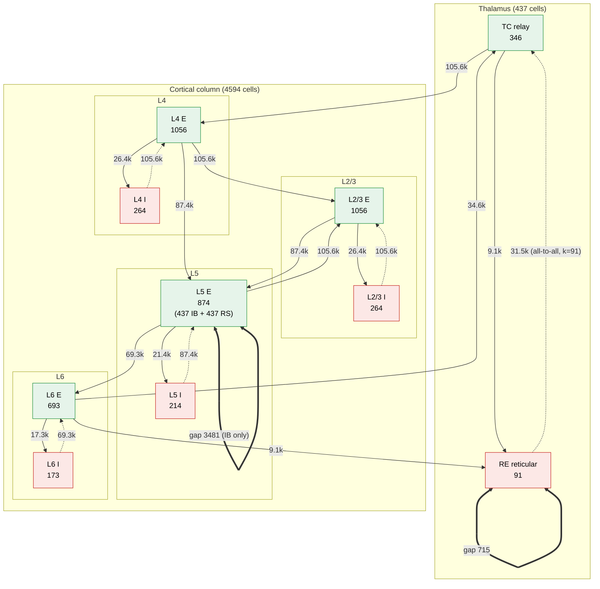

# Educational questions about the project

## 1) How do we know when a spindle starts? (grey rectangles in the figure)

Figure: `out/compare_regularity_vs_literature_score.png` (commit `7b3e1c8`).

The grey rectangles come from a simple threshold on the spindle-band amplitude.
The detector is `_literature_score` in `neuron/ctx_thalamus_mpi.py` (line ~617).

Caveat: the script that drew the figure was never committed, only the PNG.
The commit message says the shading uses this detector, but this has not been
confirmed by re-running it.

### How a spindle start is found

1. **Build an LFP-like signal.** For each excitatory layer (L2/3, L4, L5, L6),
   spike times are binned at 1 ms. Each binned signal is convolved with a
   synaptic-shaped kernel (2 ms rise, 100 ms decay) and z-scored. L5 and L6 are
   sign-flipped, and the four layers are averaged into one signal.
2. **Band-pass the signal to 10–15 Hz.** This is the lower trace of each pair
   in the figure.
3. **Take the Hilbert envelope**, `env = |hilbert(spin)|`, which is the
   instantaneous amplitude of that oscillation.
4. **Set the threshold** at `mean(env) + 1.5·SD(env)`, computed over the whole
   run.
5. **Mark events:** a spindle starts where the envelope rises above the
   threshold and ends where it falls back below. Each grey rectangle is one
   span where the envelope stays above the threshold.

### What this means for the figure

- **The "start" is when the envelope crosses the threshold, not when the
  spindle visibly begins.** In Option 1 the oscillation can be seen building up
  before the grey box. The box only covers the high-amplitude peak, roughly
  100–150 ms.
- **There is no minimum duration and no merging of nearby events.** That's why
  a very thin sliver appears near 9.6 s in Option 2. Two short crossings close
  together count as two events.
- **The threshold adapts to each run.** Option 2 has 10–15 Hz activity almost
  everywhere, which raises the envelope's mean and SD. As a result, only the
  few biggest bursts cross the threshold. So the low event count in Option 2
  partly reflects this choice of threshold, not only how the network behaves.
- **This is simpler than standard spindle detection in the literature.**
  Detectors there usually require a duration of about 0.5–2 s and use two
  thresholds: a high one to detect the event and a lower one to set its
  boundaries. The events here are much shorter than that. So the shaded boxes
  are really "spindle-band amplitude peaks", not spindles in the strict EEG
  sense. That matters if `n_spindle_events` or `spindle_cv` are compared
  directly to published numbers.

### Possible follow-ups

- Add two-threshold detection with a minimum duration, so start and end times
  match the literature definition.
- Commit the plotting script so the figure can be reproduced.

## 2) What is the network architecture? (number of neurons and synapses/projections)

Source of truth: `ParallelCorticoThalamicNet` in `neuron/ctx_thalamus_mpi.py`
(the MPI/MN5 model). All counts below are computed from its wiring code
(`DEFAULT_SIZES`, `_project`, `_wire_re_re_local`, `_wire_l5_recurrent`,
`_wire_gap_range`) with the production defaults `--conv 100`, `ib_frac=0.5`,
`gap_deg=6`, `gap_short=2`.

Two sizes are in use:

- `--scale 1.0` gives **3050 cells**, the sizes declared in
  `config/network_auditory_mn5_5k.yaml`.
- `--scale 1.65` gives **5031 cells**. This is the MN5 full-scale run (job
  45453403) and the size shown in the diagram.

### Diagram (scale 1.65, 5031 cells)

Solid arrows are excitatory (AMPA-like, E = 0 mV). Dotted arrows are inhibitory
(GABA_A). Double-headed thick links are gap junctions. Edge labels give the
number of connections (NetCons) in the projection.

### Neurons

| Population | Cell model | scale 1.0 | scale 1.65 |
|---|---|---:|---:|
| TC (thalamocortical relay) | `tc_neuron.TCCell` | 210 | 346 |
| RE (thalamic reticular) | `tc_neuron.RECell` | 55 | 91 |
| L4 E / I | `PYCell` / `FSCell` | 640 / 160 | 1056 / 264 |
| L2/3 E / I | `PYCell` / `FSCell` | 640 / 160 | 1056 / 264 |
| L5 E / I | half `PYCellIB` (intrinsically bursting), half `PYCell` (RS) / `FSCell` | 530 / 130 | 874 / 214 |
| L6 E / I | `PYCell` / `FSCell` | 420 / 105 | 693 / 173 |
| **Total** | | **3050** | **5031** |

### Projections (chemical synapses)

Wiring uses **fixed convergence**. Each target cell draws `k = min(conv, N_pre)`
random presynaptic cells, so a projection has `N_post × k` connections. Each
target has one `Exp2Syn` per projection, and every connection is a NetCon onto
it with weight `g / k`. So `g` is the total conductance a target cell gets from
that projection, in µS. The shared delay is 1 ms.

| Projection | Type (E_rev, τ1/τ2 ms) | g (µS) | k | # conn. scale 1.0 | # conn. scale 1.65 |
|---|---|---:|---:|---:|---:|
| TC → RE | AMPA (0, 0.5/2) | 0.011 | 100 | 5 500 | 9 100 |
| RE → TC | GABA_A (−85, 1/8) | 0.015 | all RE (55 / 91) | 11 550 | 31 486 |
| RE → RE | GABA_A (−75, 1/6), ±2 neighbours | 0.006 ± 0.002 per conn. | ≤4 | 214 | 358 |
| TC → L4E | AMPA (0, 0.5/2) | 0.02 | 100 | 64 000 | 105 600 |
| L4E → L2/3E | AMPA | 0.0015 | 100 | 64 000 | 105 600 |
| L4E → L5E | AMPA | 0.00075 | 100 | 53 000 | 87 400 |
| L2/3E → L5E | AMPA | 0.0015 | 100 | 53 000 | 87 400 |
| L5E → L2/3E | AMPA | 0.0015 | 100 | 64 000 | 105 600 |
| L5E → L6E | AMPA | 0.009 | 100 | 42 000 | 69 300 |
| L6E → TC | AMPA | 0.03 | 100 | 21 000 | 34 600 |
| L6E → RE | AMPA | 0.03 | 100 | 5 500 | 9 100 |
| E → I, each layer (L4, L2/3, L5, L6) | AMPA | 0.02 | 100 | 16 000 / 16 000 / 13 000 / 10 500 | 26 400 / 26 400 / 21 400 / 17 300 |
| I → E, L4, L2/3, L6 | GABA_A (−75, 1/8) | 0.08 | 100 | 64 000 / 64 000 / 42 000 | 105 600 / 105 600 / 69 300 |
| I → E, L5 | GABA_A (−75, 1/8) | `g_i_e_l5`: 0 by default, 0.02 in Options 1/2 | 100 | 53 000 | 87 400 |
| L5E → L5E recurrence (opt-in) | NMDA (Options 1/2) or Exp2Syn | `g_l5_rec`: 0 by default, 0.013 in Options 1/2 | 100 | 53 000 | 87 400 |
| **Total without L5 recurrence** | | | | **662 264** | **1 104 944** |
| **Total with L5 recurrence** | | | | **715 264** | **1 192 344** |

The L5 I → E connections are always created, even when `g_i_e_l5 = 0`. They
just carry zero weight.

Options 1 and 2 are the two L5-recurrence tunings compared in question 1.
Both use `g_l5_rec = 0.013` with the NMDA mechanism. Option 1 uses
`tau2 = 115, taur = 100`; Option 2 uses `tau2 = 200, taur = 120`.

### Gap junctions (electrical)

Small-world topology: a ring with ±3 neighbours plus 2 random shortcuts per
cell. The counts below are one-directional `GapMPI` halves.

| Group | g (µS) | scale 1.0 | scale 1.65 |
|---|---:|---:|---:|
| RE ↔ RE | 0.03 | 423 | 715 |
| L5 IB ↔ L5 IB (the first half of L5E) | 0.02 | 2 103 | 3 481 |

### What the architecture does *not* contain

- Within-layer E → E synapses, except the opt-in L5 recurrence.
- Direct L2/3 → thalamus or L6 → L4 connections. The only cortical output to
  the thalamus is L6E.
- Any input to L4E other than TC. That makes TC → L4E the only ascending arm
  of the loop.
- Any interneuron subtypes. All I cells are a single fast-spiking type
  (`FSCell`). The NEST reference model splits cells into Basket/LTS/Axoaxonic
  and RS/FRB/Tuft subtypes, and this model does not reproduce those splits.
